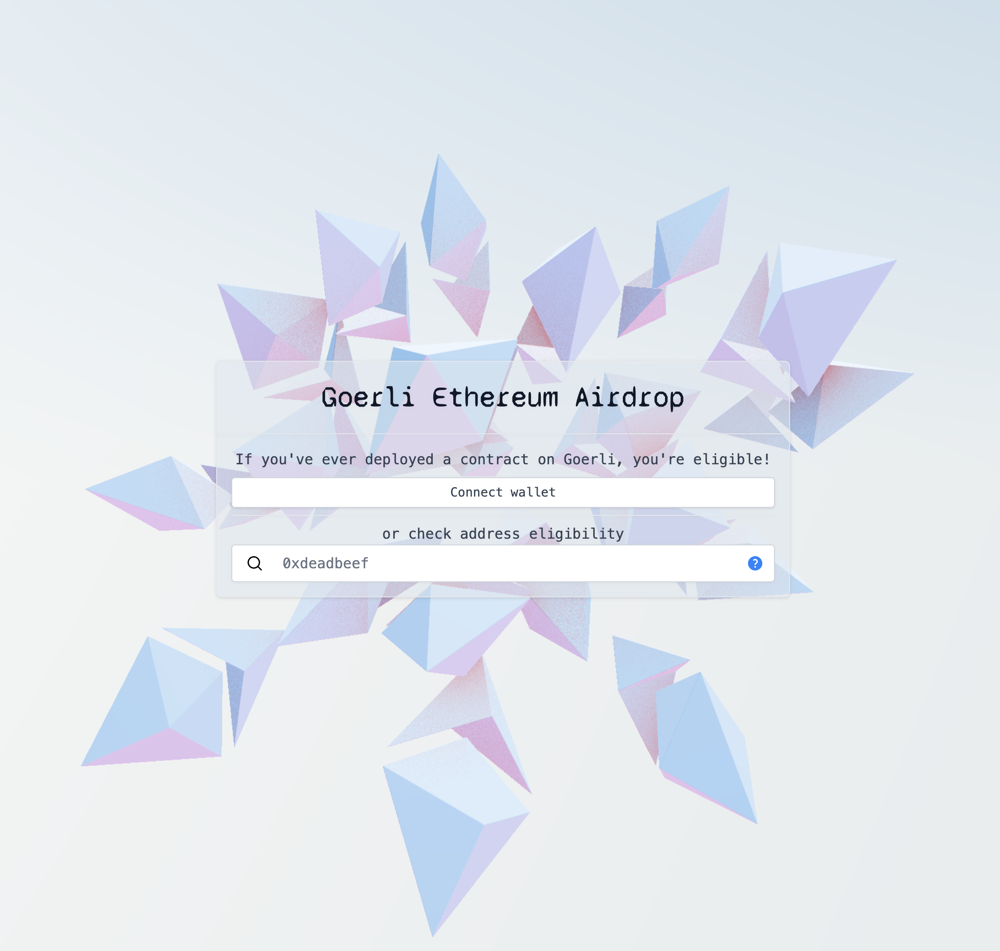

# Testnet Claim 

Repo contains a one-time claim for testnet tokens. The contract uses a merkle proof for set inclusion. The associated client guides the user through claiming on multiple networks and has some neat background physics.

## `cmds`
- `yarn install`
- `yarn test`
- `yarn start-local-backend`
- `yarn start-local-client`
- `yarn deploy-firebase`
- `yarn prod-serve`
- `yarn build-client`

## Dev workflow
1. Set up `DEV_WALLETS` environment variable – comma separated list of wallets to prepopulate with test ETH.
2. Fill out `./contracts/data/local-mt.txt` with addresses for claiming.
3. Start local nodes: `yarn start-local-backend`
4. Start local client: `yarn start-local-client`
5. Add the local testnets to wallet (as described in `contracts/README.md`).
6. Navigate to `localhost:3000`, potentially clear nonces on wallet for test networks.

# Disclaimer
*This code is being provided as is. No guarantee, representation or warranty is being made, express or implied, as to the safety or correctness of the code. It has not been audited and as such there can be no assurance it will work as intended, and users may experience delays, failures, errors, omissions or loss of transmitted information. Nothing in this repo should be construed as investment advice or legal advice for any particular facts or circumstances and is not meant to replace competent counsel. It is strongly advised for you to contact a reputable attorney in your jurisdiction for any questions or concerns with respect thereto. a16z is not liable for any use of the foregoing, and users should proceed with caution and use at their own risk. See a16z.com/disclosures for more info.*
