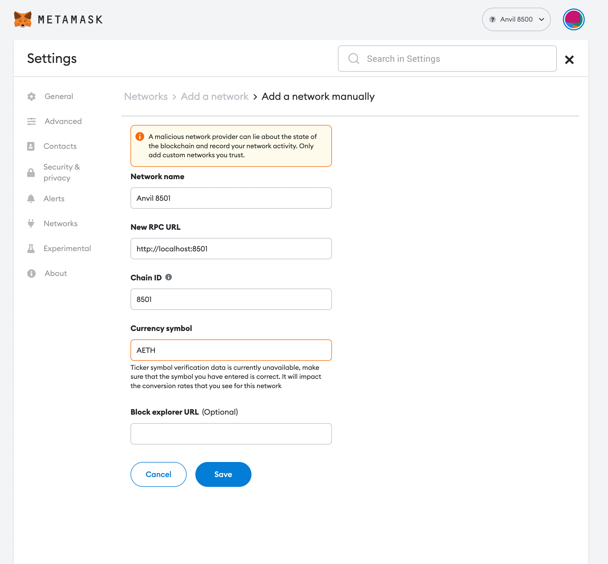

## deploy
- `npx hardhat deploy --network goerli --file mt.txt --amount 0.0001`

## collect
*Ideally use the UI for collection, but if you'd like to use cmd, run the command below.*
- `ts-node ./scripts/collect.ts --pk=<collection private key> --rpc=<rpc for relevant chain> --contract_address=<Collector contract address> --leaves_file=<Merkle tree leaves file path>`
- There are two optional cmd flags: `graffiti` / `recipient`

## dev workflow (UI testing)
- Add `Anvil 8500` and `Anvil 8501` networks to wallet

- `yarn start-local`
